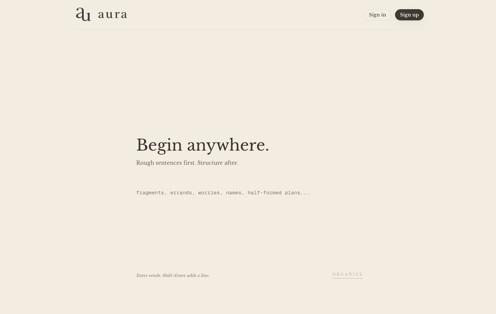

# Aura

> Turn a brain dump into a clear next step.

Aura is a calm AI task app for moments when everything is in your head at once, the list feels too heavy to start, and even writing things down feels like work.

Instead of asking you to organize first, Aura lets you type the messy version:

```text
laundry today, dentist sometime this week, reply to Sarah because that's urgent
```

Aura turns that into structured tasks:

```text
✅ Do laundry          · Today · ~45 min · Home
📅 Dentist appointment · This week · Health
⚡ Reply to Sarah      · Urgent · ~5 min · Communication
```

The product idea is simple: reduce the planning burden so you can get moving. The interface stays calm, the input stays natural, and the AI helps turn unstructured thoughts into structured tasks with the right priority, category, and time cues. When you need more support, Aura can help break things down further. When you do not, it stays out of the way.



## Why It Exists

For a lot of people, the hardest part is not checking a list. It is figuring out what the task actually is, how urgent it feels, and where to start without getting lost in the overhead.

Aura is designed around that gap. Sometimes a little structure and support are enough to turn vague mental clutter into concrete action, and that support does not look the same for everyone.

## Design Philosophy

No onboarding, no tutorial, no manual. If you can type a sentence, you can use it.

**Simplicity** - Every feature has to earn its place. If it adds complexity without clear value, it does not belong.

**Low friction** - One input, accepts anything. When something is vague, Aura asks a short follow-up rather than pretending to know what you meant.

**Less on screen** - Only what is needed, when it is needed. Details are there when they help and hidden when they do not.

**Flexible support** - Some days you want the high-level version. Some days you need help breaking a task down. Aura should support both.

## Features

- Free-form input for brain dumps, half-formed reminders, and messy planning.
- AI task parsing that turns casual language into structured tasks with categories, priorities, and dates when they are present or implied.
- Guidance that can stay high level or go deeper, depending on what helps you move.
- Clarification flow for project-like input that needs a little more shaping.
- Minimal task list designed to reduce visual noise and decision fatigue.
- Focus-oriented interactions that keep attention on the next actionable thing.

This repo contains the web prototype, built with Next.js, Tailwind CSS, Zustand, and a provider-agnostic AI parsing layer that can use OpenAI or Anthropic.

## Run It Locally

```bash
pnpm install
cp .env.example .env.local
pnpm dev
```

Set the provider you want in `.env.local`:

```env
AI_PROVIDER=openai

OPENAI_API_KEY=
OPENAI_MODEL=

ANTHROPIC_API_KEY=
ANTHROPIC_MODEL=
```

Open `http://localhost:3000`.

Useful commands:

- `pnpm dev`
- `pnpm typecheck`
- `pnpm lint`
- `pnpm test`
- `pnpm storybook`

## Docs

- [Architecture](./docs/ARCHITECTURE.md)
- [Development](./docs/DEVELOPMENT.md)
- [Deployment](./docs/DEPLOYMENT.md)
- [Design system](./docs/DESIGN_SYSTEM.md)

## License

MIT
